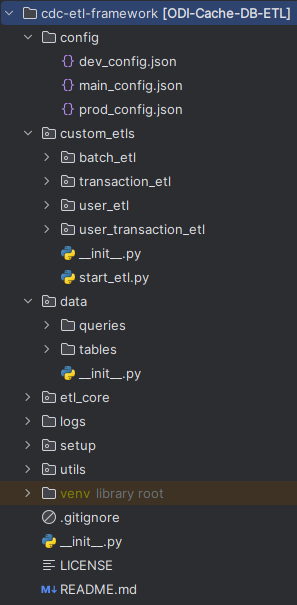

# ETL Framework Readme

This project has been developed for a vanilla python based ETL (Extract, Transform and Load) framework which have ability to incremental load by time columns based
change data capturing and full loads the tables. This readme provides an overview of the ETL (Extract, Transform, Load) framework and guides you through the setup and configuration process.

## Folder Structure

Let's take a look at the folder structure of the ETL framework:



**Description of folder structure**

```
- config: Contains the configuration files related to ETLs and source connections.
- custom_etls: Contains the customized ETLs that we want to add as pipelines.
- data: Contains table data and queries.
- etl_core: Contains the core classes of ETL functionalities.
- logs: Temporary log keeping folder. You can change this location using the main_config.json file.
- setup: Contains scripts for testing and setting up ETLs.
- utils: Contains utilities used by the program.
```

## Dependency Libraries

Following python libraries should be installed before use this framework

```shell
pip install psycopg2-binary
pip install python-json-logger
pip install mysql-connector
```

## Configuring Data Sources for ETLs

To configure the data sources for ETLs, follow these steps:

**Step 1:** Update the `dev_config.json` and `prod_config.json` files with the necessary database credentials. Provide the credentials in JSON format as shown below:

```json
{
    "db_credentials": {
        "source": {
            "db_type": "PSQL",
            "host":"localhost",
            "port": "5432",
            "db_name":"source_db",
            "username":"postgres",
            "password":"1234"
        },
        "target": {
            "db_type": "PSQL",
            "host":"localhost",
            "port": "5432",
            "db_name":"target_db",
            "username":"postgres",
            "password":"1234"
        }
    }
}
```

Note: The attributes such as `db_credentials`, `db_type`, `host`, `port`, `db_name`, `username`, and `password` are keywords. Do not change these.

**Step 2:** Update the `main_config.json` file with the following configurations:

```json
{
    "ETL_REGISTER" : {
        "user_etl":"UserETL",
        "transaction_etl": "TransactionETL",
        "batch_etl": "BatchETL",
        "user_transaction_etl": "UserTransactionETL"
    },
    "ETL_SRC_MODULE": "custom_etls",
    "LOG_PATH": "logs",
    "LOG_PREFIX": "sample",
    "TABLE_JSON_PATH": "",
    "EXTRACTOR_BATCH_SIZE": 15000
}
```

- `ETL_REGISTER`: A JSON object mapping ETL names to their respective classes. We will see how to create an ETL class with the respective functionalities in the following steps.
- `ETL_SRC_MODULE`: The folder path for custom ETL modules.
- `LOG_PATH`: The path to the log folder.
- `LOG_PREFIX`: The prefix for log file names.
- `TABLE_JSON_PATH`: The path to the table definition JSON file.
- `EXTRACTOR_BATCH_SIZE`: The batch size for the extractor.

## Configuring Table Definitions and Classes

Table definitions and classes are configured under the `data/tables` directory. 

Here is an example of a table definition JSON:

```json
{
    "<table_cluster_name>" : {
        "<table_name>": {
            "schema": "test",
            "columns": "usr_id,usr_name,contact",
            "pk": "usr_id",
            "condition": null,
            "retain_days": null,
            "mat_view": "mt_user",
            "thread_count": 1,
            "etl_type": "full-load"
        }
    }
}
```

- `<table_cluster_name>`: The name of the table cluster.
- `<table_name>`: The name of the table.
- `schema`: Specifies the database schema that the table belongs to.
- `columns`: Specifies the columns that the table contains.
- `pk`: Specifies the primary key of the table.
- `condition`: Specifies an optional condition that can be used to filter the data loaded from the source table.
- `retain_days`: Specifies the number of days that data in the table should be retained before it is deleted.
- `mat_view`: Specifies the name of the materialized view used for reading purposes.
- `thread_count`: Specifies the number of threads to use for ETL operations on the table.
- `etl_type`: Specifies the type of ETL process to be used.

## Executing a Particular ETL

To run a specific ETL, execute the following command:

```
python3 -m etl_core.start_etl <etl_name>
```

Make sure to replace `<etl_name>` with the name of the ETL you want to execute.

For more information and examples, you can visit [my GitHub repository](https://github.com/example-user/etl-framework).

---

This is the readme file for the ETL framework. It provides an overview of the folder structure, steps to configure data sources, and instructions for table definitions and executing ETLs.
